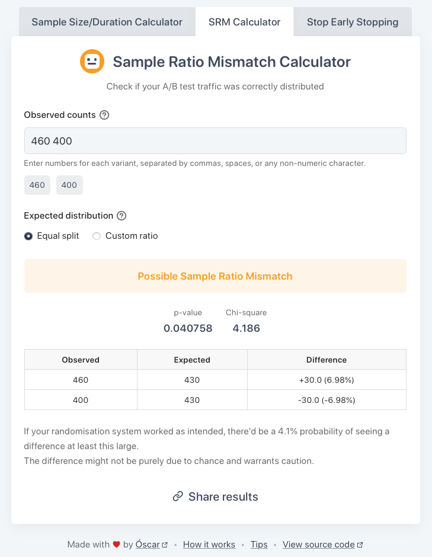

    
     
     
    
    
    
     
     
    
     
    <a href="https://srm.osc.garden">Try it out!</a>
     

## What is Sample Ratio Mismatch?

Picture this: you set up your experiment to have 50% of users on variant A and 50% on variant B. The experiment is over and you have 44,000 users in A, and 45,000 in B. Is this a problem?

Most likely. If your assignment worked properly, the probability of seeing this imbalance (or a larger one) is less than 0.1%.

When the difference between the ratios is significant, you have a Sample Ratio Mismatch (SRM). Unless you understand why it happened, you should not analyse the results of the experiment; your setup may be flawed, invalidating any conclusions.

## Features

- **Precise**: less than 0.01% deviation from Python's [scipy's](https://scipy.org/) Chi Square calculations
- **Unlimited variants**: can be used for A/B/n tests
- **Custom ratios**: you didn't run a 50-50 split? No problem!
- **Share** your results with colleagues through custom links
- **Private**: no accounts, no tracking, works offline, and no data is sent to any server

## How it works

This tool uses the **[Chi-Squared Goodness-of-Fit test](https://www.jmp.com/en/statistics-knowledge-portal/chi-square-test/chi-square-goodness-of-fit-test)** to detect Sample Ratio Mismatch (SRM). Here's the process:

1. **You provide**:
    - **Observed counts**: The actual number of users in each experiment variant.
    - **Expected distribution**: How you intended to split traffic (e.g., 50/50, or a custom ratio like 60/40).

2. **The calculator then**:
    - Determines the **expected user counts** for each variant based on your input.
    - Calculates the **Chi-Square statistic ($\chi^2$)**. This value measures how much your observed counts ($O$) deviate from the expected ones ($E$). The formula is: $\chi^2 = \sum \frac{(O - E)^2}{E}$.
        - Derives a **p-value** using the [regularised incomplete gamma function](https://en.wikipedia.org/wiki/Incomplete_gamma_function#Regularized_gamma_functions). The degrees of freedom ($df$) are calculated as (number of variants - 1). The p-value is then: $p\text{-value} = 1 - P(\frac{df}{2}, \frac{\chi^2}{2})$
        - For smaller chi-square values: [series expansion method](https://dlmf.nist.gov/8.7)
        - For larger values: [continued fraction method](https://dlmf.nist.gov/8.9)

3. **Interpretation**:
    - The p-value tells you the probability of seeing your observed user distribution (or one even more imbalanced) if the traffic splitting was actually working as intended.
        - **`p < 0.01`**: Strong evidence of SRM.
        - **`0.01 ≤ p < 0.05`**: Possible SRM.
        - **`p ≥ 0.05`**: No significant evidence of SRM.

## Contributing

Please do! I'd appreciate bug reports, improvements (however minor), suggestions…

The calculator uses vanilla JavaScript, HTML, and CSS. To run locally:

1. Clone the repository: `git clone https://github.com/welpo/srm.git`
2. Navigate to the project directory: `cd srm`
3. Start a local server: `python3 -m http.server`
4. Visit `http://localhost:8000` in your browser

The important files are:

- `index.html`: Basic structure
- `styles.css`: Styles
- `app.js`: Logic
- `tests.js`: Tests, generated with `srm/srm_test_generator.py` (add `?test` to the URL to run validation tests)

## Need help?

Something not working? Have an idea? Let me know!

- Questions or ideas → [Start a discussion](https://github.com/welpo/srm/discussions)
- Found a bug? → [Report it here](https://github.com/welpo/srm/issues/new?&labels=bug)
- Feature request? → [Let me know](https://github.com/welpo/srm/issues/new?&labels=feature)

## License

This SRM calculator is free software: you can redistribute it and/or modify it under the terms of the [GNU Affero General Public License as published by the Free Software Foundation](./COPYING), either version 3 of the License, or (at your option) any later version.
